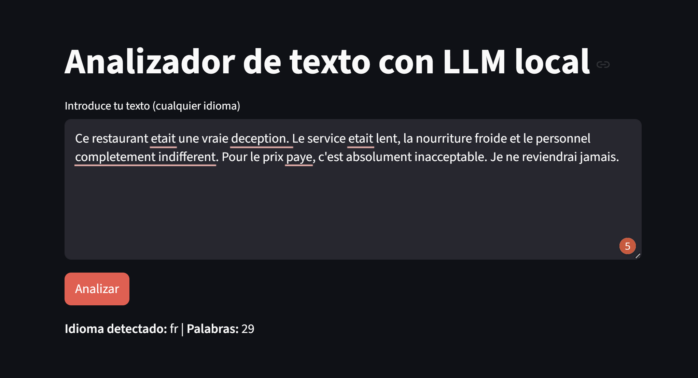
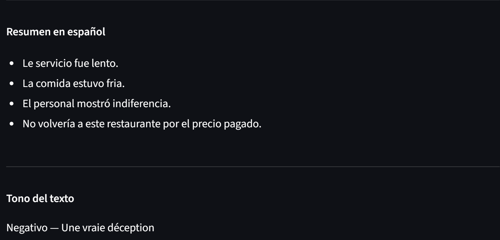

# Multilingual Text Analyzer with Local LLM

**Subject:** Natural Language Processing
**Student:** Miguel Ángel Lorenzo Fossati

---

## 1. Problem Description

In this assignment we are asked to design and implement a small application that uses a large language model running locally to solve a language-related task. I have developed an application that analyzes texts written in different languages and returns a summary in Spanish along with an estimate of the tone of the text.

The application includes several stages: a text preprocessing phase, a call to the model to generate a summary, and a second call to classify the tone. Everything is presented through a graphical interface designed for an end user.

---

## 2. System Design and Workflow

The application is divided into three steps:

1. The user writes or pastes a text into the interface.
2. The system cleans the text and detects its language.
3. The local model generates a summary in Spanish and classifies the tone.

### Preprocessing

Noise is removed from the text (URLs, repeated spaces) using regular expressions.
The language is automatically detected using the `langdetect` library.

### Processing with the LLM

Two separate calls are made to the model:

- One to generate a summary with 3-5 key points in Spanish.
- Another to classify the tone and return the response in JSON format.

Separating the tasks allows a specific prompt to be used for each one and better control over the output.

### Graphical Interface

Implemented with Streamlit. It shows the detected language, number of words, generated summary and tone of the text.

---

## 3. Model Selection and Justification

Model: Llama 3.2 (3B parameters) running with Ollama

| Criterion  | Decision                               |
|------------|----------------------------------------|
| Execution  | 100% local, no external API            |
| Size       | 2 GB, manageable on standard hardware  |
| Languages  | Native multilingual support            |
| Speed      | Responses in a few seconds on CPU      |
| License    | Meta Llama 3 Community License         |

The 1B model was discarded due to its lower ability to follow instructions. The 7B model was discarded due to its higher RAM requirements. The 3B version offers a reasonable balance between quality and computational cost.

---

## 4. Implementation

All the logic is concentrated in a single file `app.py`.

### Tools Used

| Component          | Tool               | Version |
|--------------------|--------------------|---------|
| Local LLM          | Ollama + Llama 3.2 | 0.6.1   |
| Graphical interface | Streamlit         | 1.56.0  |
| Language detection | langdetect         | 1.0.9   |
| Text cleaning      | re (Python stdlib) | --      |
| Language           | Python             | 3.10+   |

### Project Structure

texto-analisis/
 - app.py
 - requirements.txt

### Prompt Engineering

Two different system prompts were defined:

For the summary:
"Summarize the text in 3-5 key points in Spanish. Use a list format with dashes. Only the points, no introduction."

For the tone:
"Respond: {"tono": "positivo/negativo/neutro/mixto", "razon": "frase corta"}"

---

## 5. Results, Limitations and Improvements

### Results

The application works correctly for medium-length texts in multiple languages.

Example of use:
- Input: "Im very comfortable here and it is a beautifull place" (English)
- Detected language: en
- Summary: key points in Spanish with the main ideas
- Tone: positive / mixed

  

### Limitations

- Short texts: `langdetect` can give incorrect results with fewer than 10 words.
- Tone classification: the model sometimes classifies clearly positive texts as "mixed". This is a common limitation of small models in subjective classification tasks.
- Speed: two calls to the model can take between 10 and 30 seconds per analysis on CPU.
- No history: the application does not save previous results between sessions.

### Possible Improvements

- Add few-shot prompting to improve tone classification.
- Reduce the categories to positive, negative and neutral.
- Allow the user to choose the model from the interface.
- Save history.
- Export results to a .txt file.